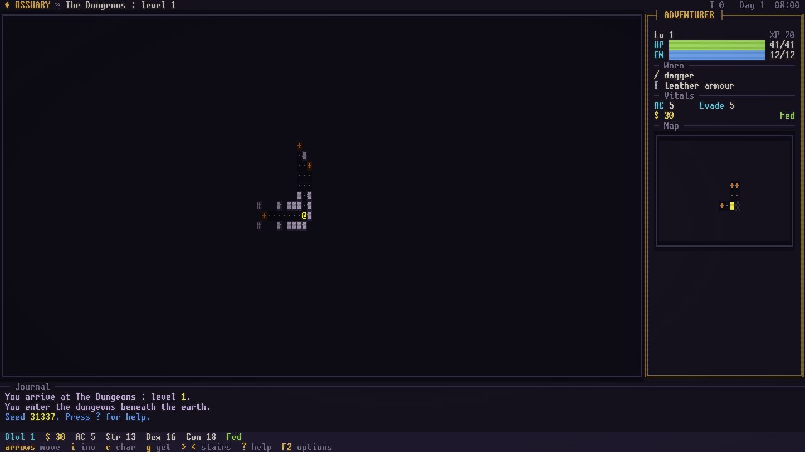
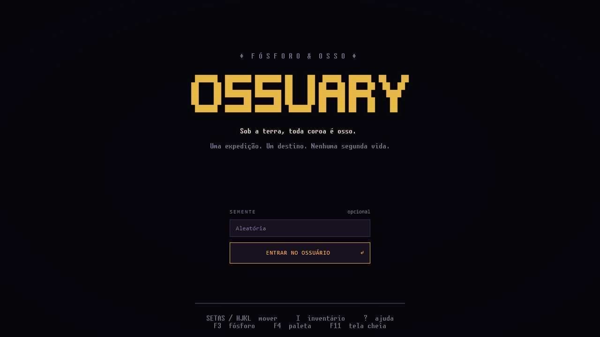
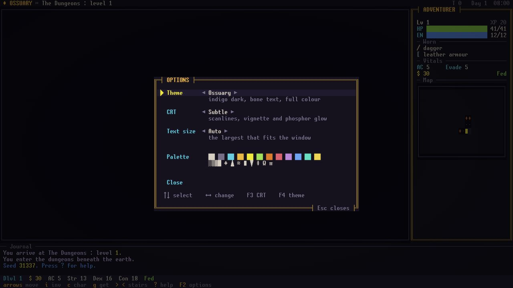

<div align="center">

# 🦴 Ossuary — Fósforo & Osso

**Um roguelike ASCII de fantasia sombria.** O mundo jogou seus mortos, seus reis e seus deuses num só poço.
Você desce para roubar o que sobrou.


[English](README.md) · **Português (Brasil)** · [Como contribuir](CONTRIBUTING.pt-BR.md) · [Changelog](CHANGELOG.pt-BR.md) · [Docs (EN)](docs/README.md)



</div>

---

## O jogo

Desça pelo Ossuary, pegue o **Amuleto de Yendor** e traga de volta à luz do dia. Tudo é desenhado com uma única fonte bitmap 8×16
num terminal estilo CRT; o jogo é uma exploração de masmorras por turnos com um mundo vivo na superfície.
A semente **é** o save: mesma semente, mesmas teclas, mesma expedição.

### O que há na **versão 20**

| | |
|---|---|
| 🏛️ **O mundo lembra** *(novo)* | Um passado gerado da semente: casas que sobem e caem, reis que se sucedem pelo sangue, pela espada ou pela escolha dos senhores, guerras, pestes, cidades que queimaram, e os mortos enterrados em níveis de verdade com o nome talhado na pedra. O painel de lendas (F8) junta o que você aprende com bardos, eruditos, estantes, boatos, gravuras e túmulos. Sangue por espécie e rastros que desbotam: um herói sangrando é farejado, e Shift+M segue presas feridas. Ataques vêm às cidades num dia da semana: lute nas ruas ou encontre uma loja queimada. |
| 📜 **Todos os ofícios** | Poções, pergaminhos e varinhas se aprendem usando. Relíquias têm uma história gerada da semente (quem forjou, para quem, como se perderam) e lembram dos chefes que mataram. Teares e alambiques, artesãos que seguem trabalhando, kobolds arqueiros com flechas de verdade, caravanas que você escolta ou rouba na estrada, pechincha no balcão e comerciantes que lembram do que você fez. |
| 🏹 **Da forja ao mercado** | Arcos, bestas e fundas disparam flechas, virotes e pedras de verdade: cada tiro gasta uma, e você recolhe onde caiu. Faça as suas, com ponta de prata para os mortos. A melhor obra de um mestre às vezes ganha nome e vira relíquia de quem a fez. `Shift+I` examina qualquer coisa: metal, autor, qualidade, desgaste, valor. Os ferreiros da cidade vendem o próprio trabalho assinado. |
| 🪙 **Moeda e caravana** | Cada cidade tem um mercado que se lembra de você: encha um ferreiro de espadas e ele paga menos por dias, uma caravana barateia um tipo de mercadoria, uma estrada saqueada encarece. Dias de feira trazem mercadores de fora, um quadro semanal mostra o que o povo quer e oferece, e você pode alugar um balcão que vende enquanto está fora. Carisma, o humor do comerciante, a Guilda e o nome de um mestre mexem nos preços; pedágios, aluguel e taxas mantêm o ouro valendo. O diário lembra onde as coisas venderam. |
| 🪓 **Sangue e osso** | Mire seus golpes (`Shift+F`): nas pernas, no braço da arma, nos olhos, nas asas. Lâminas decepam membros de monstros, um braço destroçado larga a arma, uma asa quebrada derruba quem voa, feras aleijadas fogem e as cegadas golpeiam a esmo. Ataduras, fogo que cauteriza, cicatrizes que as pessoas notam, serpentes e um manual de golpes do Guerreiro pago com Vigor. |
| ⚒️ **Ferro e ofício** | Todo equipamento é feito de algo: cobre, bronze, aço, prata, ferro frio, mithril, adamantina, obsidiana, osso, madeira. A prata queima os mortos, o equipamento gasta e quebra, o ferreiro conserta. E qualquer um pode viver de um ofício: são 16 (ferreiro, armeiro, alquimista, cozinheiro, luthier, minerador…), cerca de 100 receitas, coleta na estrada, música por moedas, mestres e encomendas. Você nunca precisa descer. |
| 🩸 **Carne e osso** | Todo golpe acerta algum lugar: perna quebrada faz mancar, braço ferido estraga a mira, golpe na cabeça atordoa, olho cortado enxerga menos, ferimentos sangram, saram e deixam cicatriz. Nos monstros também, cada um com seu corpo. |
| ✨ **Magias que você vê** | 322 magias em 8 escolas, todas animadas: a bola de fogo é uma bola de fogo que voa e explode, o raio se bifurca, o meteoro cai. |
| 📖 **55 livros** | Mago, necromante, clérigo/paladino, patrulheiro (natureza) e ladino (sombra) têm cerca de cinquenta magias cada, em cinco níveis de profundidade. |
| ⚔️ **Itens com uma magia dentro** | O equipamento mágico aleatório vem imbuído com uma magia que combina com ele: espadas carregam ataques, armaduras carregam proteções, botas carregam saltos. E disparam sozinhos. |
| 🗡️ **43 itens únicos e 4 conjuntos** | Relíquias nomeadas em todos os ramos; muitas emprestam uma magia enquanto você as segura. |
| 🧪 **Varinhas, pergaminhos e poções que são magias** | Mesmos efeitos, mesmas animações, sem mana. |
| 🏰 **O mundo** | Cinco ramos e um ramo-portal, overworld de nove regiões, cidades verticais, chefes, facções, reputação, corrupção e mutações, companheiros, criação. |
| 🔊 **Som e música** | Dezoito trilhas que acompanham o momento (título, estrada, cidades de dia e de noite, taverna, loja, templo, cada ramo de masmorra, combate e dois chefes), quinze stingers e sons de menu: tudo sintetizado, sem arquivos de áudio. |
| 🕯️ **Um mundo que lembra** | Moradores com personalidade e memória, diálogos, missões com prazo (diário em `F7`), crime e a Guarda, rumores, viajantes na estrada e a trama principal *O Selo*, com seis finais. |
| 🌍 **Dois idiomas** | Português (Brasil) e inglês, trocáveis a qualquer hora com `F2`. |

<details>
<summary><b>Todo o resto</b></summary>

- Masmorras por turnos em cinco ramos, com overworld de nove regiões, estradas, relógio de dia e noite, encontros e viagem.
- **Cidades verticais**: povoados murados com torres, sótãos, criptas e porões. Ferreiro, armeiro, alquimista, torre de magos, taverna, estalagem, templo, guilda, biblioteca, quartel, bancas, e as pessoas que vivem neles.
- Sete raças, oito classes, habilidades, talentos, seis deuses (com rivais, provações e sacrifícios) e altares.
- Chefes por ramo, monstros nativos com hábitos, facções de monstros, cofres, caches armadilhados e chaves de latão; o ramo-portal opcional **O Anexo**.
- **Corrupção e mutações**, companheiros contratados, criação leve (molotovs, lâminas de osso), conjuntos de artefatos e relíquias que corrompem.
- Um mundo vivo: reputação com quatro casas, contratos da Guilda, eventos de estrada, moradores com rotina que lembram de você.
- Explorar sozinho, viajar até escadas e altares, descansar, andar segurando a tecla, furtividade e ruído, armadilhas para achar e desarmar.
- Modos: Normal, Clássico (sem fome), Hardcore, Mergulho, Pelado, Treinado; desafio diário com placar local; conquistas, morgue, expedições passadas e ossos de heróis mortos.
- Efeitos sonoros de onda quadrada, água animada, tiles quadrados opcionais, abertura animada.
- Temas CRT / âmbar / fósforo verde, fonte bitmap fixa 8×16, escala inteira.

</details>

<div align="center">
 
</div>

## Instalar (jogadores)

Baixe o instalador `Ossuary_0.20.0_x64-setup.exe` (Windows x64) numa [release](https://github.com/Bruno-BRG/ossuary/releases)
ou na saída do build, e execute. Não precisa de SDK. É preciso o WebView2 (já vem no Windows 11).

> O nome público de uma versão é só **Versão N** (esta é a **Versão 20**), como em *Project Zomboid*. Instaladores e manifestos usam o
> `0.N.0` correspondente, porque instalador do Windows, npm e Cargo pedem três números.

## Compilar do código

O guia completo está em [INSTALL.pt-BR.md](INSTALL.pt-BR.md). Começo rápido (Windows x64):

```powershell
.\desktop.ps1 setup    # SDK .NET 10 local + pacotes npm
.\desktop.ps1 dev      # abre o app Tauri com recarga do frontend
.\desktop.ps1 web      # o mesmo motor no navegador, só em loopback
.\desktop.ps1 build    # executável de release + instalador NSIS
```

## Controles

Setas, teclado numérico ou `hjkl` movem; `yubn` são as diagonais. `i` inventário, `c` personagem, `g` pegar, `>` / `<` escadas,
`Shift+Z` magias, `Shift+V` habilidades, `Shift+F` mirar numa parte do corpo, `r` ler, `z` usar varinha, `q` beber, `P` vestir anel ou amuleto, `?` ajuda, `F2` opções, `F3` CRT, `F4` paleta, `F11` tela cheia.

- Nas cidades, esbarre numa pessoa para conversar, e num balcão, quadro de avisos ou altar para negociar.
- Na lista de magias, `←`/`→` trocam a escola, uma letra ou `Enter` conjura, `◆` marca magias emprestadas pelo equipamento.

A lista completa está em [docs/game/controls.md](docs/game/controls.md).

## Como é feito

```
engine/Ossuary.Core      simulação + telas como dados   (sem UI, sem plataforma: a "regra de ouro")
engine/Ossuary.Desktop   host local: entrada, modais, protocolo JSON por stdin/stdout
engine/Ossuary.Headless  testes, dumps ASCII, bots de soak e balanceamento
desktop/                 janela Tauri (Rust), terminal TypeScript/Canvas, empacotamento
assets/fonts             a fonte bitmap canônica e sua atribuição
docs/                    arquitetura, sistemas, magias e itens, lore (em inglês)
```

A simulação vive só em C#; o frontend desenha a grade que o motor manda e toca as animações que o motor grava.
Comece por [docs/tech/architecture.md](docs/tech/architecture.md) e [docs/design/spells-and-items.md](docs/design/spells-and-items.md).

## Testes

```powershell
.\fastcheck.ps1                 # type-check de C# e TypeScript
.\headless.ps1 test             # simulação + fluxo do desktop
.\headless.ps1 fx fireball      # a animação de uma magia, passo a passo em ASCII
.\headless.ps1 dump panels      # UI em ASCII
.\headless.ps1 soak 50 500      # bot aleatório
.\check.ps1                     # tudo: motor, frontend, IPC empacotado, Rust
```

## Contribuir

Relatos de bug, magias, itens, traduções e notas de balanceamento são bem-vindos. Leia o [CONTRIBUTING.pt-BR.md](CONTRIBUTING.pt-BR.md) primeiro:
ele explica a estrutura, as regras e como adicionar uma magia ou um item em poucas linhas.

## Licença

O código é distribuído sob a [licença MIT](LICENSE). A fonte **unscii-16** (viznut, domínio público) tem atribuição própria em [assets/fonts/NOTICE.md](assets/fonts/NOTICE.md).
